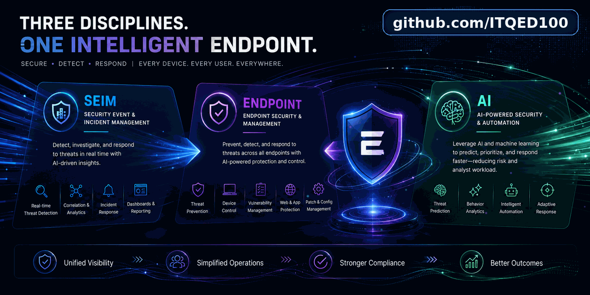

# Hi, I'm ITQED100 👋

Senior enterprise endpoint, cybersecurity, automation, and emerging AI systems practitioner with 20+ years of experience supporting federal agencies and federal healthcare environments.

My background is rooted in large-scale Windows endpoint engineering, MECM/SCCM, vulnerability remediation, application deployment, operating-system lifecycle management, automation, and technical troubleshooting.

More recently, I have been expanding that foundation into modern cloud endpoint management, security operations, and AI-assisted systems engineering with a focus on practical implementation, validation, traceability, and requirements-driven design.

---

## 🛠️ What I Work On

- Enterprise endpoint engineering
- MECM / SCCM
- Windows application deployment
- Task sequences and operating-system deployment
- Vulnerability and patch management
- PowerShell and Python automation
- Endpoint security and configuration management
- Microsoft Intune and Entra ID labs
- Microsoft Defender XDR and Defender for Endpoint labs
- Microsoft Sentinel and KQL
- Security automation and SOAR concepts
- Retrieval-Augmented Generation (RAG)
- AI tool calling and agentic workflows
- AI-assisted requirements engineering
- AI output validation and source traceability

---

## 🚀 Current Focus

I am actively building hands-on labs that bridge traditional enterprise endpoint engineering with modern cloud-native endpoint management, security operations, and applied AI.

Current areas of focus include:

- Microsoft Intune endpoint management
- Entra ID device identity and enrollment
- Windows Update for Business
- Win32 application deployment
- Defender for Endpoint integration
- Endpoint compliance and security policy
- Defender XDR investigation
- KQL threat hunting and detection engineering
- Microsoft Sentinel analytics
- Security automation and automated incident triage
- Azure AI Foundry
- Azure AI Search
- Vector search and embeddings
- RAG architecture
- AI tool selection
- Requirements generation
- Grounding and policy traceability
- Validation of AI-generated requirements against authoritative sources

---

## 📂 Featured Repositories

### [Endpoint Management Labs](https://github.com/ITQED100/Endpoint-Management-Labs-)

Hands-on labs covering modern endpoint management, security operations, automation, troubleshooting, and Microsoft security technologies.

### [AI Playground](https://github.com/ITQED100/AI)

A growing collection of hands-on AI labs focused on practical implementation, experimentation, and validation.

Current work includes a Healthcare Requirements Agent using:

- Azure AI Foundry
- Azure AI Search
- Vector retrieval
- RAG
- Python tool calling
- Multi-tool selection
- Security and privacy requirements generation
- Source-grounded validation

---

## ⚙️ Engineering Approach

I tend to focus on practical problems:

> **Understand the problem → define the requirement → engineer the solution → automate where useful → validate the result → document what was learned**

I use AI-assisted development as an engineering accelerator, but I do not treat model output as authoritative by default.

For AI systems, I focus on:

- Grounding outputs in authoritative sources
- Separating probabilistic AI behavior from deterministic security controls
- Testing implementation against requirements
- Identifying unsupported assumptions
- Maintaining traceability between generated outputs and source material

---

## 🧰 Technology Focus

---

## 🎓 Certifications

- CISSP
- PMP
- ITIL v3 Foundation
- Microsoft Azure AI Fundamentals
- AWS Certified AI Practitioner
- Microsoft Certified: System Center 2012 Configuration Manager

---

## 🎯 Areas of Interest

`Endpoint Security` • `Endpoint Engineering` • `Vulnerability Management` • `Security Automation` • `Cloud Endpoint Management` • `Detection Engineering` • `AI Systems` • `RAG` • `Agentic Workflows` • `Technical Business Analysis` • `AI-Assisted Engineering`
